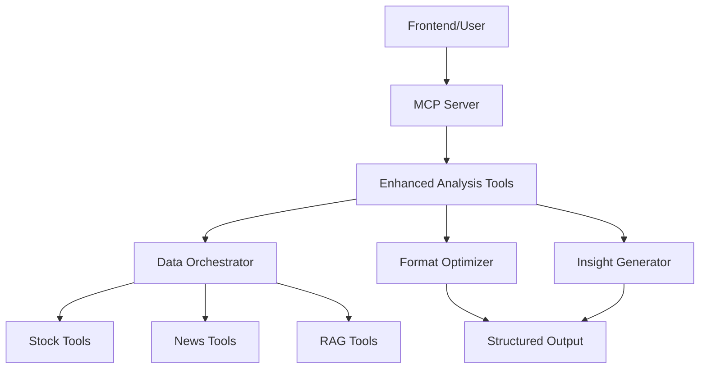

# Design Document

## Overview

The Enhanced Stock Analysis & Comparison System will transform the current verbose, technical stock analysis output into user-friendly, actionable insights. The system will provide two main capabilities: enhanced single stock analysis and multi-stock comparison, both delivered through new MCP tools with improved data presentation and insight generation.

## Architecture

The system follows a modular architecture with clear separation of concerns:



### Key Components:
- **Enhanced Analysis Tools**: New MCP tools for single and comparative analysis
- **Data Orchestrator**: Coordinates data fetching from multiple sources
- **Format Optimizer**: Transforms raw data into user-friendly formats
- **Insight Generator**: Creates actionable recommendations from analysis data

## Components and Interfaces

### 1. Enhanced Single Stock Analysis Tool

**Interface**: `analyze_stock_enhanced(symbol, period, analysis_type)`

**Parameters**:
- `symbol`: Stock symbol (e.g., "HDFCBANK")
- `period`: Time period ("1d", "1w", "1m", "3m", "6m", "1y")
- `analysis_type`: Type of analysis ("quick", "detailed", "quarterly")

**Output Structure**:
```json
{
  "stock_info": {
    "symbol": "HDFCBANK",
    "name": "HDFC Bank Limited",
    "current_price": "₹991.20",
    "period": "Last 3 months"
  },
  "performance": {
    "change_percent": 1.99,
    "change_value": "₹+19.30",
    "direction": "up",
    "volatility": "low",
    "trend_indicator": "📈"
  },
  "sentiment_summary": {
    "overall_score": 9.6,
    "interpretation": "Positive",
    "confidence": "moderate",
    "article_count": 17,
    "breakdown": {
      "positive": 6,
      "negative": 5,
      "neutral": 6
    }
  },
  "key_events": [
    {
      "title": "HDFC Bank Q2 earnings: Net profit rises 11%",
      "date": "2025-10-18",
      "source": "Upstox",
      "relevance_score": 76,
      "quality": "GOOD",
      "impact": "positive"
    }
  ],
  "insights": {
    "bottom_line": "HDFCBANK showed moderate upward movement with strong quarterly results driving positive sentiment.",
    "key_drivers": ["Strong Q2 earnings", "Improved asset quality"],
    "risk_factors": ["Market volatility", "Sector headwinds"],
    "recommendation": "Hold with positive outlook",
    "confidence_level": "moderate"
  },
  "correlation": {
    "sentiment_price": -0.850,
    "strength": "strong",
    "interpretation": "Sentiment and price move in opposite directions",
    "trading_signal": "Monitor sentiment for contrarian signals"
  }
}
```

### 2. Multi-Stock Comparison Tool

**Interface**: `compare_stocks(symbols, period, comparison_type)`

**Parameters**:
- `symbols`: Array of 2-3 stock symbols (e.g., ["HDFCBANK", "ICICIBANK", "AXISBANK"])
- `period`: Time period for comparison
- `comparison_type`: Type of comparison ("performance", "sentiment", "comprehensive")

**Output Structure**:
```json
{
  "comparison_summary": {
    "period": "Last 3 months",
    "stocks_analyzed": 3,
    "best_performer": "HDFCBANK",
    "worst_performer": "AXISBANK"
  },
  "stock_comparison": [
    {
      "symbol": "HDFCBANK",
      "rank": 1,
      "performance": {
        "change_percent": 1.99,
        "trend": "📈",
        "volatility": "low"
      },
      "sentiment": {
        "score": 9.6,
        "trend": "positive"
      },
      "key_strength": "Strong quarterly earnings",
      "key_weakness": "High valuation"
    }
  ],
  "comparative_insights": {
    "performance_leader": {
      "symbol": "HDFCBANK",
      "reason": "Consistent growth with strong fundamentals"
    },
    "sentiment_leader": {
      "symbol": "HDFCBANK", 
      "reason": "Positive earnings surprise"
    },
    "recommendation_ranking": [
      {
        "symbol": "HDFCBANK",
        "rating": "BUY",
        "rationale": "Strong fundamentals and positive momentum"
      }
    ]
  }
}
```

### 3. Format Optimizer Component

**Responsibilities**:
- Transform raw numerical data into human-readable formats
- Apply consistent visual indicators (emojis, arrows, colors)
- Structure data hierarchically for easy scanning
- Eliminate redundant information

**Key Functions**:
- `format_price_change(value, percentage)`: Returns formatted price with indicators
- `format_sentiment_score(score)`: Normalizes and formats sentiment percentages
- `format_time_period(start_date, end_date)`: Creates human-readable time ranges
- `apply_visual_indicators(data)`: Adds emojis and visual cues

### 4. Insight Generator Component

**Responsibilities**:
- Generate actionable insights from raw analysis data
- Create plain-language interpretations of technical metrics
- Provide investment recommendations with confidence levels
- Identify key drivers and risk factors

**Key Functions**:
- `generate_bottom_line(analysis_data)`: Creates 1-2 sentence summary
- `identify_key_drivers(news_data, price_data)`: Extracts main factors
- `assess_risk_factors(volatility, sentiment, correlation)`: Identifies risks
- `create_recommendation(performance, sentiment, correlation)`: Generates advice

## Data Models

### StockAnalysis Model
```python
@dataclass
class StockAnalysis:
    symbol: str
    period: str
    current_price: float
    change_percent: float
    change_value: float
    sentiment_score: float
    sentiment_interpretation: str
    key_events: List[NewsEvent]
    insights: AnalysisInsights
    correlation: CorrelationData
```

### ComparisonResult Model
```python
@dataclass
class ComparisonResult:
    symbols: List[str]
    period: str
    stock_rankings: List[StockRanking]
    comparative_insights: ComparisonInsights
    recommendation_ranking: List[Recommendation]
```

### NewsEvent Model
```python
@dataclass
class NewsEvent:
    title: str
    date: str
    source: str
    relevance_score: float
    quality: str
    impact: str
    summary: str
```

## Correctness Properties

*A property is a characteristic or behavior that should hold true across all valid executions of a system-essentially, a formal statement about what the system should do. Properties serve as the bridge between human-readable specifications and machine-verifiable correctness guarantees.*

Let me analyze the acceptance criteria to determine which are testable as properties:

<function_calls>
<invoke name="prework">
<parameter name="featureName">enhanced-stock-analysis

Based on the prework analysis, I can see that most acceptance criteria are testable as properties. Let me perform a property reflection to eliminate redundancy:

**Property Reflection:**
- Properties 1.1, 3.1, 5.5 all relate to structured response format - can be combined
- Properties 1.2, 3.2, 3.6 all relate to formatting consistency - can be combined  
- Properties 2.1, 5.3 both relate to input validation - can be combined
- Properties 3.5, 4.4, 6.4 all relate to handling insufficient data - can be combined
- Properties 6.5, 4.4 both relate to error handling - can be combined
- Properties 7.1, 7.2 both relate to relevance filtering - can be combined

### Core Correctness Properties

**Property 1: Structured Response Consistency**
*For any* valid stock analysis request, the response should contain all required fields (symbol, performance metrics, sentiment data, insights) in a consistent JSON structure with proper visual hierarchy and formatting
**Validates: Requirements 1.1, 3.1, 5.5**

**Property 2: Data Formatting Standards**
*For any* numerical data in analysis responses, all values should be properly formatted with appropriate symbols (currency, percentages, separators) and visual indicators (emojis, arrows)
**Validates: Requirements 1.2, 3.2, 3.6**

**Property 3: Sentiment Score Normalization**
*For any* sentiment data presented to users, sentiment scores should be normalized to the -100% to +100% range with human-readable interpretations
**Validates: Requirements 1.3**

**Property 4: News Event Filtering and Structure**
*For any* analysis containing news events, the system should limit results to top 3 most relevant articles (relevance > 60%) with complete structured information (title, source, date, relevance score)
**Validates: Requirements 1.4, 3.4, 7.1, 7.2**

**Property 5: Correlation Interpretation**
*For any* correlation data included in analysis, the system should provide plain-language interpretation of correlation strength and appropriate trading signals when correlation is strong
**Validates: Requirements 1.5, 4.3**

**Property 6: Content Deduplication**
*For any* analysis response, the system should eliminate redundant information and filter out duplicate or near-duplicate news articles
**Validates: Requirements 1.6, 7.6**

**Property 7: Input Validation and Error Handling**
*For any* MCP tool call, the system should validate input parameters (2-3 symbols for comparison, valid date ranges) and return structured error responses with helpful messages when validation fails
**Validates: Requirements 2.1, 5.3, 5.4**

**Property 8: Comparison Data Consistency**
*For any* multi-stock comparison, all stocks should have data for the same time period and results should be presented in tabular format with clear best/worst performer indicators
**Validates: Requirements 2.2, 2.3, 2.4**

**Property 9: Sentiment Difference Highlighting**
*For any* multi-stock comparison where sentiment scores differ by more than 30 points, the system should prominently highlight these differences
**Validates: Requirements 2.5**

**Property 10: Ranking and Recommendations**
*For any* stock comparison or analysis, the system should provide complete rankings with rationale explanations and actionable recommendations
**Validates: Requirements 2.6, 4.5**

**Property 11: Human-Readable Time Formatting**
*For any* time period displayed in analysis, dates should be converted to human-readable formats (e.g., "Last 3 months") instead of exact date ranges
**Validates: Requirements 3.3**

**Property 12: Insufficient Data Handling**
*For any* analysis where correlation data is weak, price data is missing, or data quality is poor, the system should clearly state limitations and provide alternative suggestions instead of misleading information
**Validates: Requirements 3.5, 4.4, 6.4, 7.3**

**Property 13: Bottom Line Summary Generation**
*For any* completed analysis, the system should generate a clear bottom line summary of 1-2 sentences with key insights
**Validates: Requirements 4.1**

**Property 14: Significant Movement Analysis**
*For any* stock with price movements greater than 5%, the system should provide explanatory analysis based on news and sentiment data
**Validates: Requirements 4.2**

**Property 15: Risk Warning Generation**
*For any* analysis where risk conditions are detected (high volatility, negative sentiment, weak fundamentals), the system should include appropriate risk warnings
**Validates: Requirements 4.6**

**Property 16: Tool Registration and Availability**
*For any* MCP server instance, both "analyze_stock_enhanced" and "compare_stocks" tools should be properly registered and available
**Validates: Requirements 5.1, 5.2**

**Property 17: Backward Compatibility**
*For any* existing frontend integration, the system should continue to function correctly after adding new enhanced analysis tools
**Validates: Requirements 5.6**

**Property 18: Performance Requirements**
*For any* analysis request, single stock analysis should complete within 10 seconds and multi-stock comparison should complete within 20 seconds
**Validates: Requirements 6.1, 6.2**

**Property 19: Timeout and Degradation Handling**
*For any* slow backend API response, the system should implement timeout handling and graceful degradation with clear messaging
**Validates: Requirements 6.3**

**Property 20: Error Logging**
*For any* error that occurs during analysis, the system should log detailed error information for debugging purposes
**Validates: Requirements 6.5**

**Property 21: Caching Behavior**
*For any* frequently requested analysis (same symbol and period within 5 minutes), the system should serve results from cache to improve response times
**Validates: Requirements 6.6**

**Property 22: Data Quality Validation**
*For any* correlation calculation, the system should enforce minimum data point requirements and show publication dates with source credibility indicators for news events
**Validates: Requirements 7.4, 7.5**

## Error Handling

The system implements comprehensive error handling at multiple levels:

### Input Validation Errors
- Invalid stock symbols → Return structured error with suggested valid symbols
- Invalid date ranges → Return error with acceptable date format examples
- Too many symbols in comparison → Return error with maximum limit (3 stocks)

### Data Availability Errors
- No price data available → Graceful degradation with clear messaging
- No news articles found → Show analysis with price data only, note limitations
- Backend API timeout → Return partial results with timeout warning

### Processing Errors
- Correlation calculation failures → Skip correlation section, continue with other analysis
- Sentiment analysis errors → Use fallback sentiment scoring, log detailed errors
- Format optimization errors → Return raw data with formatting warning

### Performance Degradation
- Slow API responses → Implement progressive timeouts (5s, 10s, 15s)
- High load conditions → Enable caching and reduce data fetching scope
- Memory constraints → Limit historical data range and news article count

## Testing Strategy

The system will use a dual testing approach combining unit tests and property-based tests:

### Unit Testing Focus
- **Specific Examples**: Test known stock symbols with expected outputs
- **Edge Cases**: Empty responses, malformed data, extreme values
- **Integration Points**: MCP tool registration, backend API connections
- **Error Conditions**: Invalid inputs, timeout scenarios, data unavailability

### Property-Based Testing Focus
- **Universal Properties**: All 22 correctness properties listed above
- **Comprehensive Input Coverage**: Random stock symbols, date ranges, comparison sets
- **Data Transformation Validation**: Sentiment normalization, price formatting, time conversion
- **Response Structure Validation**: JSON schema compliance, required field presence

### Property Test Configuration
- **Minimum 100 iterations** per property test due to randomization
- **Test Tags**: Each property test tagged with format: **Feature: enhanced-stock-analysis, Property {number}: {property_text}**
- **Test Framework**: Use Hypothesis for Python property-based testing
- **Data Generators**: Smart generators for valid stock symbols, realistic date ranges, and market data

### Testing Implementation Strategy
- Unit tests validate specific examples and integration points
- Property tests verify universal correctness across all inputs
- Both approaches are complementary and necessary for comprehensive coverage
- Property tests catch edge cases that unit tests might miss
- Unit tests provide concrete examples of expected behavior